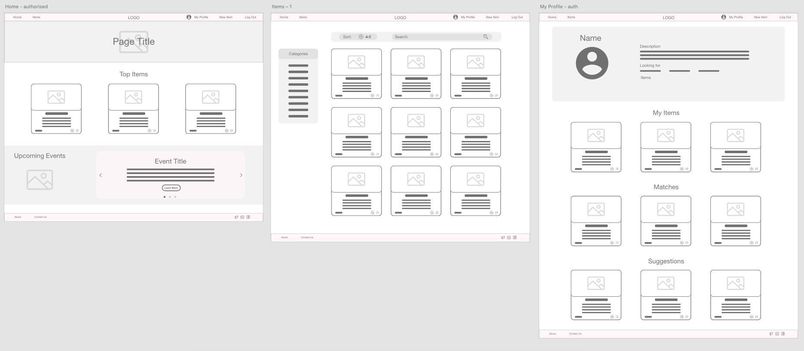
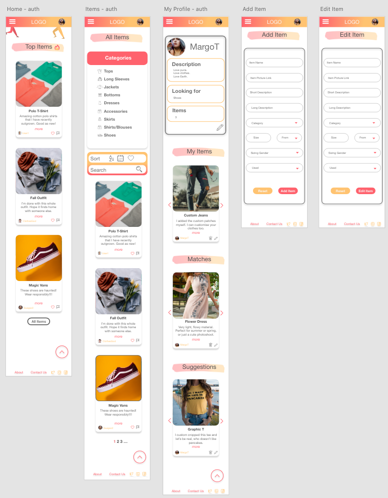
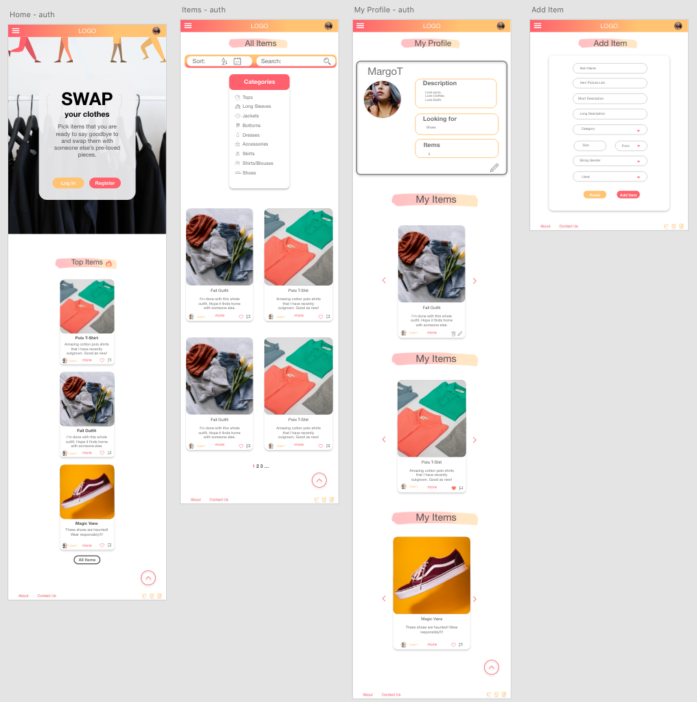

<h1 align="center">SWAP your clothes</h1>
<h1 align="center"></h1>

 <a href="https://clothes-swap-app.herokuapp.com/"> :star2:	</a> :point_left: Live website

   :point_left: GitHub Repository
 
 ## About

xxx

## Table of Contents

[User Experience (UX)](#UX)

[Features](#features)

[Technologies Used](#technologies)

[Testing](#testing)

[Deployment](#deployment)

[Known Bugs](#bugs)

[Credits](#credits)

## User Experience (UX)

### User Stories

- #### xxx
    1. xxx
    1. xxx
    1. xxx
- #### xxx
    1. xxx
    1. xxx
    1. xxx
    1. xxx
    1. xxx

### Design

- #### Color scheme
    - xxx.

        

- #### Typography
    - xxx

        

    - xxx

        

- #### Imagery
    - xxx
    - xxx

- #### Wireframes
    - Wireframes were created using Adobe Xd
    - Mobile Wireframes
        - [Unauthorised User](https://github.com/LigaMoon/swap-clothes-app/tree/main/static/graphics/readme/wireframes-mobile-unauthorised.png) :point_left:
        - [Authorised User](https://github.com/LigaMoon/swap-clothes-app/tree/main/static/graphics/readme/wireframes-mobile-authorised.png) :point_left:
        - [Admin](https://github.com/LigaMoon/swap-clothes-app/tree/main/static/graphics/readme/wireframes-mobile-admin.png) :point_left:

         

    - Tablet Wireframes
        - [Unauthorised User](https://github.com/LigaMoon/swap-clothes-app/tree/main/static/graphics/readme/wireframes-tablet-unauthorised.png) :point_left:
        - [Authorised User](https://github.com/LigaMoon/swap-clothes-app/tree/main/static/graphics/readme/wireframes-tablet-authorised.png) :point_left:
        - [Admin](https://github.com/LigaMoon/swap-clothes-app/tree/main/static/graphics/readme/wireframes-tablet-admin.png) :point_left:

         

    - Desktop Wireframes
        - [Unauthorised User](https://github.com/LigaMoon/swap-clothes-app/tree/main/static/graphics/readme/wireframes-desktop-unauthorised.png) :point_left:
        - [Authorised User](https://github.com/LigaMoon/swap-clothes-app/tree/main/static/graphics/readme/wireframes-desktop-authorised.png) :point_left:
        - [Admin](https://github.com/LigaMoon/swap-clothes-app/tree/main/static/graphics/readme/wireframes-desktop-admin.png) :point_left:

         

- #### Mockups
    - Mockups were created using Adobe Xd
    - Mobile Mockups
        - [Unauthorised User](https://github.com/LigaMoon/swap-clothes-app/tree/main/static/graphics/readme/mockups-mobile-unauthorised.png) :point_left:
        - [Authorised User](https://github.com/LigaMoon/swap-clothes-app/tree/main/static/graphics/readme/mockups-mobile-authorised.png) :point_left:
        - [Admin](https://github.com/LigaMoon/swap-clothes-app/tree/main/static/graphics/readme/mockups-mobile-admin.png) :point_left:

         

    - Tablet Mockups
        - [Unauthorised User](https://github.com/LigaMoon/swap-clothes-app/tree/main/static/graphics/readme/mockups-tablet-unauthorised.png) :point_left:
        - [Authorised User](https://github.com/LigaMoon/swap-clothes-app/tree/main/static/graphics/readme/mockups-tablet-authorised.png) :point_left:
        - [Admin](https://github.com/LigaMoon/swap-clothes-app/tree/main/static/graphics/readme/mockups-tablet-admin.png) :point_left:

         

    - Desktop Mockups
        - [Unauthorised User](https://github.com/LigaMoon/swap-clothes-app/tree/main/static/graphics/readme/mockups-desktop-unauthorised.png) :point_left:
        - [Authorised User](https://github.com/LigaMoon/swap-clothes-app/tree/main/static/graphics/readme/mockups-desktop-authorised.png) :point_left:
        - [Admin](https://github.com/LigaMoon/swap-clothes-app/tree/main/static/graphics/readme/mockups-desktop-admin.png) :point_left:

         

 
## Features

### Existing Features

#### Common Features Across All Pages
- [x] **xxx** - xxx
    - xxx
    - xxx
- [x] **xxx**
    - xxx

### Specific to Pages
- [x] **xxx**
    - xxx

### Future Features
- [ ] xxx
        

- [ ] xxx

## Technologies Used

### Languages Used

- [xxx](xxx)

### Frameworks, Libraries and Programs Used
- [xxx](xxx) - xxx

## Testing

 ### Functionality Testing
- #### xxx
    - xxx
    - xxx

 

### HTML5 validator
- xxx - xxx - [Results](xxx)

### CSS3 validator - Pass

### JSHint validator
- xxx

### Usability Testing
- xxx

### Compatibility Testing
- Browser Compatibility

    | Screen size\Browser | Safari           | Opera            | Microsoft Edge   | Chrome           | Firefox          | Internet Explorer |
    | --------------------|:----------------:|:----------------:|:----------------:|:----------------:|:----------------:|:-----------------:|
    | Mobile              |:heavy_check_mark:|:heavy_check_mark:|:heavy_check_mark:|:heavy_check_mark:|:heavy_check_mark:| Not Tested        |
    | Tablet              |:heavy_check_mark:|:heavy_check_mark:|:heavy_check_mark:|:heavy_check_mark:|:heavy_check_mark:| Not Tested        |
    | Laptop              |:heavy_check_mark:|:heavy_check_mark:|:heavy_check_mark:|:heavy_check_mark:|:heavy_check_mark:| Not Tested        |
    | Desktop             |:heavy_check_mark:|:heavy_check_mark:|:heavy_check_mark:|:heavy_check_mark:|:heavy_check_mark:| Not Tested        |

- xxx

### Performance Testing
- xxx.
    - Home Page - [Results](xxx)
    - Constellations Page - [Results](xxx)
    - Zodiac Signs Page - [Results](xxx)
    - Calculator Page - [Results](xxx)

        

### Testing User Stories 
- #### xxx
    1. xxx
        - xxx
        - xxx
    1. xxx
        - xxx
        - xxx

## Deployment

## Known Bugs
- xxx

## Credits

### Code :floppy_disk:
- xxx

### Content :book:

- xx

### Media :clapper:
- xx

### Acknowledgements

- xx

