<h1 align="center">SWAP your clothes</h1>
<h1 align="center">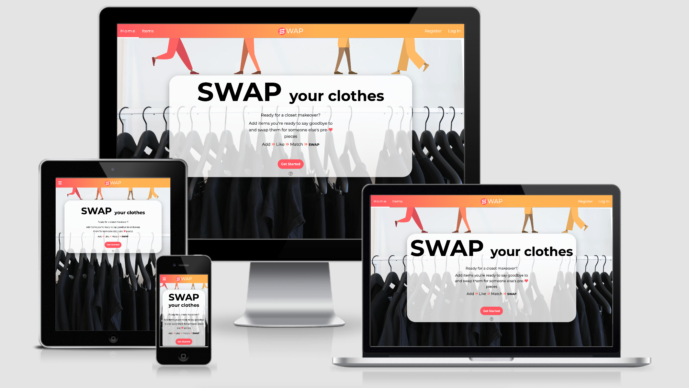</h1>

 <a href="https://clothes-swap-app.herokuapp.com/"></a> :point_left: Live website

  <a href="https://github.com/LigaMoon/swap-clothes-app"></a> :point_left: GitHub Repository
 
 ## About

This website is an alternative to thrifting, buying, and donating clothes by facilitating users to swap their pre-loved items. Not only is it great for the environment and allows users to connect with like-minded people, but it is cost-friendly too.

## Table of Contents

1. [User Experience (UX)](#user-experience)
    1. [User Stories](#user-stories)
    1. [Design](#design)
        - [Color sheme](#color-scheme)
        - [Typography](#typography)
        - [Imagery](#imagery)
        - [Wireframes](#wireframes)
        - [Mockups](#mockups)

[Features](#features)

[Technologies Used](#technologies-used)

[Testing](#testing)

[Deployment](#deployment)

[Credits](#credits)


## User Experience (UX)

### User Stories

- #### Common user stories
    1. I want to intuitively navigate through the site to browse the content.
    1. I want the experience of using this site to be interactive.
    1. I want to be able to view all clothing items.
    1. I want to be able to sort all items by the most recent added.
    1. I want to be able to sort all items by alphabetical and reverse alphabetical order.
    1. I want to be able to filter items by their categories.
    1. I want to be able to search for a specific item.
    1. I want to be able to understand the purpose of the site.
    1. I want to be able to contact the owner of the site.
    1. I want the page to be responsive on all screen sizes.
    1. I want to be able to navigate to the top of the page quickly, particularly in the mobile view.

- #### As a first time visitor
    1. I want to be able to find the 'Register' page easily.
    1. I want to be able to register easily
    
- #### As a returning user
    1. I want to be able to navigate to the 'Login' page easily.
    1. I want to be able to Log In quickly.
    1. I want to add new items easily.
    1. I want to be able to edit and delete my items.
    1. I want to like items.
    1. I want to be able to flag inappropriate content.
    1. I want to see the items that I have liked.
    1. I want to be able to update my profile.
    1. I want to view all my added items.
    1. I want to view all items I have matched with.
    1. I want to see items that matched the categories that I'm looking for.
    1. I want to be able to contact another user if I match to swap the items.
    1. I want to be able to Log out.

- #### As an admin
    1. I want to be able to unflag an item if it's been flagged incorrectly.
    1. I want to be able to delete an item if it's inapropriate.


### Design

- #### Color scheme
    - I wanted to create a fun/colorful but clean and simple (looking not coding) look to the site. I aimed to make swapping clothes and contributing to sustainable living - interesting and interactive. The inspiration for the colors came from [uiGradidents](https://uigradients.com/#SweetMorning) website, 'Sweet Morning' gradient. Colors used for this gradient and also as my accent colors are 'Fiery Rose' (#FF5F6D) and 'Mellow Apricot' (#FFC371). The primary accent color was 'Fiery Rose' as it provides more contrast against the white background - which is the dominant color of the website. The text color chosen was 'Davys Gray' (#585858) to create a softer look as opposed to opting to use black text, while still maintaining comfortable contrast between the background and the text. Finally, I used black as the main color for the Landing page to create an impactful first impression when a user first visits the site. The color palette was assembled using [coolors](https://coolors.co/ffc371-ff5f6d-ffffff-585858-000000) color palette generator.

        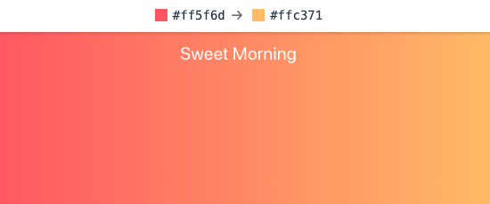
        

- #### Typography
    - The font used for this website is a sans serif type font 'Montserrat' with Sand Serif as a fallback font. I chose this font from [Google Fonts](https://fonts.google.com/specimen/Montserrat?query=Mont&preview.text=SWAP%20your%20clothes&preview.text_type=custom) website with the main aim to keep the text clean, clear, and easily readable. Since the website contains colorful accents and gradients, I opted to use only one font for the whole website with changing font weight and font style instead. 

        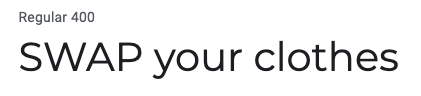


    - [Font awesome](https://fontawesome.com/) icons were used across pages to emphasize the meaning of the text it was placed alongside, allow the user to understand content faster, and add to the fun look of the site. 

- #### Imagery
    - Images
        - The primary reason for using images is for informative purposes. Images are displayed in item cards to allow users to visually engage with items added by other users and decide if they are interested in the item.
        - The secondary purpose of the images is aesthetic. The images displayed on cards are kept quite large and the same size while not being distorted. This attributes to the clean, organized look of the website. An image is also used as a hero image that takes the full screen to separate the page and not distract the user from the message on the landing page.
        - All images have been taken from [unspalsh](https://unsplash.com/) and minified using [tinyJPG](https://tinyjpg.co)

    - Graphics
        - Graphics are used for aesthetic and design purposes only. The legs on the landing page set the tone for the website and the colors tie in with the header gradient to create a sense of uniformity.
        - Graphics used were designed by [Pablo Stanley from Hhmaaans](https://www.humaaans.com/) and [Katerina Limpitsouni from unDraw](https://undraw.co/)

- #### Other 
    - Technology
        - [Materialize](https://materializecss.com/) front-end framework to implement responsive design and features.
        - [Swseetalert](https://sweetalert2.github.io/) to display confirmation pop-up for deleting or flaggin items. 
        - [slick carousel](https://kenwheeler.github.io/slick/) to contain items on the 'My Profile' page. I opted to use this as opposed to materialize carousel due to ease of implementation as Materialize carousel uses IDs as triggers which are not ideal as the data was rendered by looping through the database.
    - Shadows
        - Instead of creating borders around items and sections, shadows were used instead. It creates a 3D effect and an illusion of a clean, non-restricted space.


- #### Wireframes
    - Wireframes were created using Adobe Xd
    - Mobile Wireframes
        - [Unauthorised User](https://github.com/LigaMoon/swap-clothes-app/tree/main/static/graphics/readme/wireframes/wireframes-mobile-unauthorised.png) :point_left:
        - [Authorised User](https://github.com/LigaMoon/swap-clothes-app/tree/main/static/graphics/readme/wireframes/wireframes-mobile-authorised.png) :point_left:
        - [Admin](https://github.com/LigaMoon/swap-clothes-app/tree/main/static/graphics/readme/wireframes/wireframes-mobile-admin.png) :point_left:

         

    - Tablet Wireframes
        - [Unauthorised User](https://github.com/LigaMoon/swap-clothes-app/tree/main/static/graphics/readme/wireframes/wireframes-tablet-unauthorised.png) :point_left:
        - [Authorised User](https://github.com/LigaMoon/swap-clothes-app/tree/main/static/graphics/readme/wireframes/wireframes-tablet-authorised.png) :point_left:
        - [Admin](https://github.com/LigaMoon/swap-clothes-app/tree/main/static/graphics/readme/wireframes/wireframes-tablet-admin.png) :point_left:

         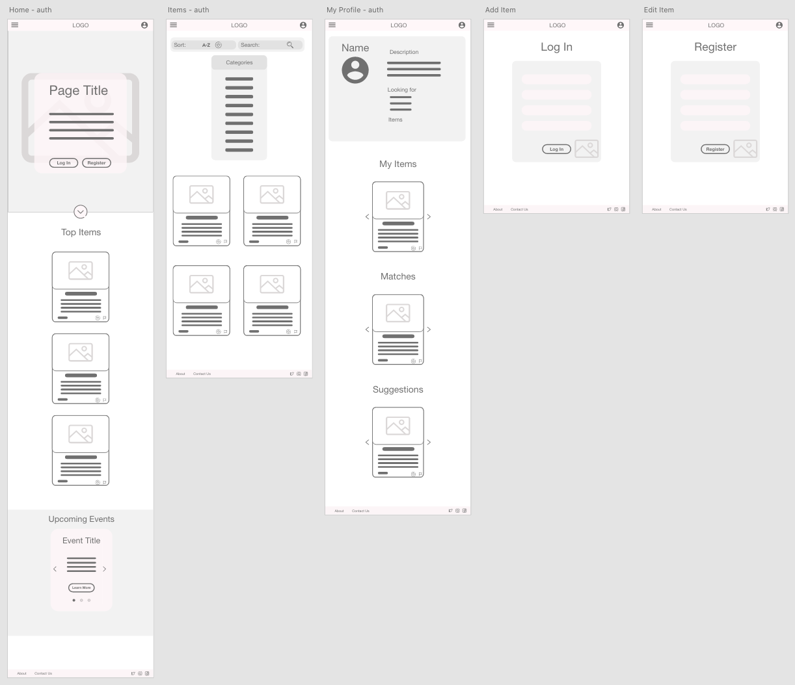

    - Desktop Wireframes
        - [Unauthorised User](https://github.com/LigaMoon/swap-clothes-app/tree/main/static/graphics/readme/wireframes/wireframes-desktop-unauthorised.png) :point_left:
        - [Authorised User](https://github.com/LigaMoon/swap-clothes-app/tree/main/static/graphics/readme/wireframes/wireframes-desktop-authorised.png) :point_left:
        - [Admin](https://github.com/LigaMoon/swap-clothes-app/tree/main/static/graphics/readme/wireframes/wireframes-desktop-admin.png) :point_left:

         


- #### Mockups
    - Mockups were created using Adobe Xd
    - Mobile Mockups
        - [Unauthorised User](https://github.com/LigaMoon/swap-clothes-app/tree/main/static/graphics/readme/mockups/mockups-mobile-unauthorised.png) :point_left:
        - [Authorised User](https://github.com/LigaMoon/swap-clothes-app/tree/main/static/graphics/readme/mockups/mockups-mobile-authorised.png) :point_left:
        - [Admin](https://github.com/LigaMoon/swap-clothes-app/tree/main/static/graphics/readme/mockups/mockups-mobile-admin.png) :point_left:

         

    - Tablet Mockups
        - [Unauthorised User](https://github.com/LigaMoon/swap-clothes-app/tree/main/static/graphics/readme/mockups/mockups-tablet-unauthorised.png) :point_left:
        - [Authorised User](https://github.com/LigaMoon/swap-clothes-app/tree/main/static/graphics/readme/mockups/mockups-tablet-authorised.png) :point_left:
        - [Admin](https://github.com/LigaMoon/swap-clothes-app/tree/main/static/graphics/readme/mockups/mockups-tablet-admin.png) :point_left:

         

    - Desktop Mockups
        - [Unauthorised User](https://github.com/LigaMoon/swap-clothes-app/tree/main/static/graphics/readme/mockups/mockups-desktop-unauthorised.png) :point_left:
        - [Authorised User](https://github.com/LigaMoon/swap-clothes-app/tree/main/static/graphics/readme/mockups/mockups-desktop-authorised.png) :point_left:
        - [Admin](https://github.com/LigaMoon/swap-clothes-app/tree/main/static/graphics/readme/mockups/mockups-desktop-admin.png) :point_left:

         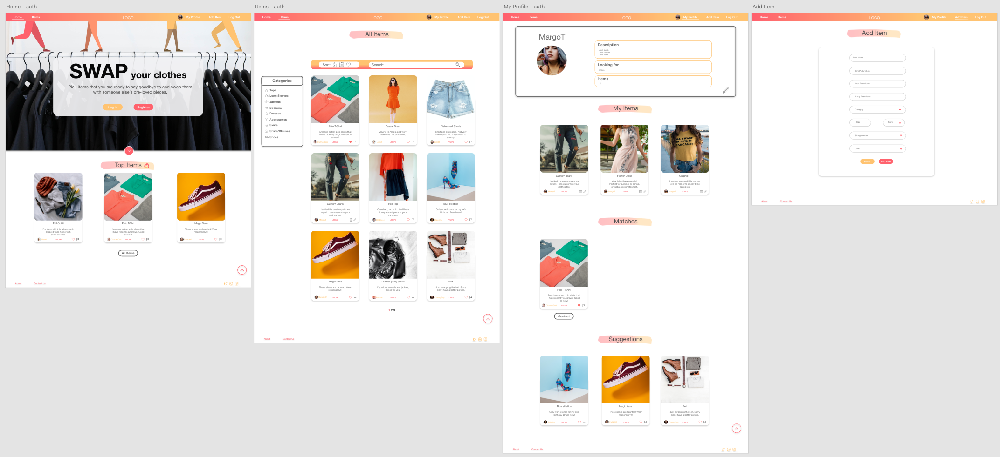


## Features

### Existing Features

#### Common Features Across Pages
- [x] **Header** - facilitates an effortless navigation across all pages
    - The header is positioned to always be visible at the top of the screen (mobile, tablet, and desktop) which allows visitors to find it quickly.
    - The brand logo is positioned at the top of the page in the header and redirects the user back to the home page. This allows the user to easily find the homepage.
    - The page navigation is located in the header at the top of the page on desktop and laptop sizes and a side navigation component on mobile and tablet sizes. This adheres to the navigation conventions allowing the user to intuitively navigate the page.
    - Navigation links expand and are underlined when hovered over on larger screen sizes, letting the user know that these are clickable links.
    - The navigation link, matching the page that the user is visiting, stays 'active'(which matches the hover effect from the previous point) to let the user quickly establish which page she/he is visiting.
    - Navigation links collapse in a personalized hamburger menu when viewed in mobile sizes.
- [x] **Heading**
    - All headings are styled in the same manner to let the user understand the page structure quickly.
- [x] **Links/buttons**
    - All links have a hover effect and are noticeably different than the rest of the text around them, indicating that they are clickable.
    - All external links open in a new tab to allow the user to easily navigate back to the page.
    - Buttons increase in size and have a shadow effect applied when hovered over.
- [x] **Footer**
    - Footer is always displayed at the bottom of the page, regardless of the content size.
    - 'Go to the top' link included allowing the user to easily navigate to the top which is particularly important on mobile screen sizes.
    - Socials are displayed and grouped. They are displayed in the footer to adhere to the convention and let the user locate them quickly.
- [x] **Card Items** - display clothing items added by users
    - All cards are the same size regardless of the content amount. This is achieved by limiting characters allowed when an item is added. This provides consistency and creates predictability of how the page will look.
    - Images take the most of the space and are fitted to be contained within a space without being distorted. This creates a visually appealing and not text-heavy site and keeps the user interested to look through items.
    - Each item has a heading and a short description is shown with an option to get more detailed information once clicked on.
    - Item creator and their image is displayed in the card footer. If the user has matched with the creator of the item, the username can be clicked on and reveals the creator's social media icons.
    - Delete and edit icons are displayed in the card footer to the creator of the item.
    - Flag item is displayed in the c rd footer allowing users to flag inappropriate content and only the admin to unflag it.
    - Floating 'like' button is displayed at the bottom of the image. It has 3 different instances - disabled to the creator of the item, empty heart on unliked items, and filled heart on liked items.
    - Confirmation for deleting and flagging items is displayed using [sweetalert](https://sweetalert2.github.io/) which pops-up and provides feedback after confirmation.
- [x] **Responsivensess**
    - All Pages are responsive and provide the same functionality regardless of the viewport size.
- [x] **Accessibility**
    - There are no flashing images or sounds to hinder the user experience.
- [x] **Flash messages**
    - Messages displayed at the top of the page to provide the user with feedback when the user logs-out, registers, etc.


### Specific to Pages
- [x] **Home** Page
    - Short introduction to let the user know what the page is.
    - 'Get Started' button that navigates an unauthorized user to the 'Register' page. This allows users to find the Register page easily and a user will more likely create an account. If a user is logged in and navigates to the 'Home' page, the 'Get Started'  button will redirect them to the 'Items' page.
    - A helper icon displayed under the call-to-action button that triggers the 'About' modal which has more detailed information about how the site works. This further provides clarity of the meaning of the website.
    - Hot Items section displays the 3 most liked items which might be a factor in deciding to create an account.
- [x] **Items** Page
    - Category filter allows users to filter all items by categories that allow users to view items that they are interested in. Furthermore, the displayed categories have been formatted to let the user know what they have selected. User can clear all filters to display all items
    - Sort functionality allows an unauthorized user to sort items by the most recently added, alphabetical order, and reverse alphabetical order. Authorized users and admin have additional functionality to sort items by their liked items and flagged items.
    - Search functionality allows the user to search for items using specific words or phrases. The items are searched by using their headings and short descriptions.
    - Pagination allows the page not to get overcrowded and display only 9 items at a time. The total number of items is displayed alongside the page number to let the user know how many items there are altogether.
- [x] **My Profile** Page
    - Top component displays user information letting the user know what details they have entered.
    - Edit Profile button allows the user to edit their profile
    - Responsive carousels containing Added items, matched items, and suggested items. This allows the page not to get too overcrowded while still having a good overview of all sections. It scales down depending on the screen size. The carousel items have arrow buttons to facilitate site navigation, icons at the bottom indicating how many slides there are and additionally, the slides can be dragged and swiped.
- [x] **Register, Log In, Add Item** Pages
    - Responsive forms to allow users to easily fill them out on all screen sizes. 
    - Forms provide validation if an input field is required and provides the user with real-time feedback if the value entered is valid. This lets the user save time by fixing the input field before submitting the form if relevant.


### Future Features
- [ ] Add the' Events' section at the bottom of the 'Home' page to create real-life swapping events.

    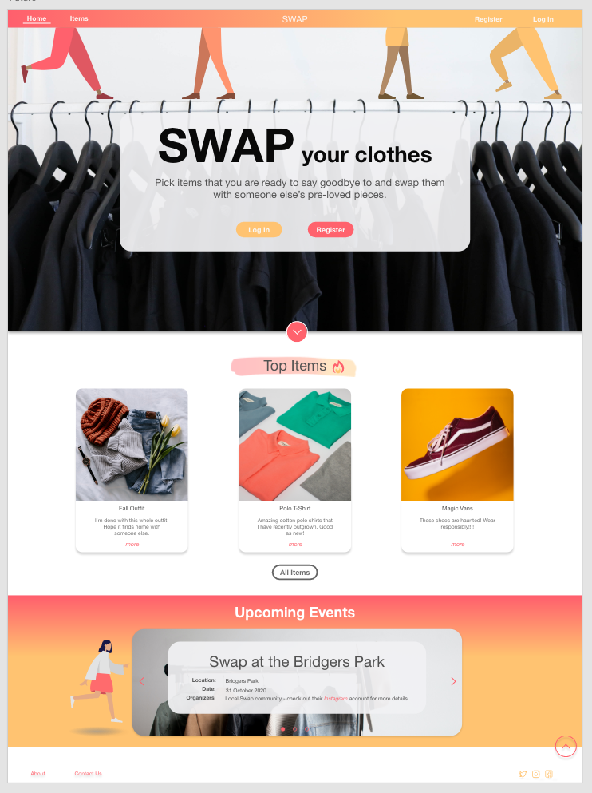

- [ ] Implement additional 'liked items' and 'flagged items' (for admin) sections in 'My Profile' page 
- [ ] Add password confirmation when the user is registering and let them view their password if they wish so.
- [ ] Allow users to edit their passwords and delete their accounts.
- [ ] Implement flash messages as toasters.
- [ ] Allow user to upload their images and store them on Cloudinary.
- [ ] Let users visit each other's pages to get 'the socials' details.
- [ ] Facilitate an in-app communication.


## Technologies Used

### Languages Used

- [HTML5](https://en.wikipedia.org/wiki/HTML5)
- [CSS3](https://en.wikipedia.org/wiki/Cascading_Style_Sheets)
- [JavaScript](https://www.javascript.com/)
- [Python 3.8.5](https://www.python.org/)

### Frameworks, Libraries and Programs Used
- Front-End
    - [Materialize v1.0.0](https://materializecss.com/) - Used for the responsive layout as well as the navigation, header, footer, forms, dropdowns, item cards, modals.
    - [Font Awesome](https://fontawesome.com/) - Font Awesome was used to add social media icons at the bottom of the page and icons throughout the pages.
    - [Google Fonts](https://fonts.google.com/) - Google Fonts was used to import 'Montserrat' font in the style.css file.
    - [Sweetalert 2](https://sweetalert2.github.io/) - Used to display pop-up confirmation modals.
    - [Slick](https://kenwheeler.github.io/slick/) - Used to dispaly responsive item carousels on 'My Profile' pages.
    - [jQuery 3.5.1](https://jquery.com/) - Used to initialize Materialize components, used in building sweetalert and applying classes on window resize.
- Back-End
    - [Flask 1.1.2](https://flask.palletsprojects.com/en/1.1.x/) - Web micro-framework written in Python and was used in building the web application. 
    - [Flask-Paginate 0.7.1](https://github.com/lixxu/flask-paginate) - Used to implement the pagination within the flask framework.
    - [Jinja 2.11.2](https://jinja.palletsprojects.com/en/2.11.x/) - Templating language used across all HTML pages
    - [Werkzeug 1.0.1](https://werkzeug.palletsprojects.com/en/1.0.x/) - Used in hashing and unhashing user passwords.
    - [MongoDB](https://www.mongodb.com/) - Non relational document-oriented database. Used to store all JSON-like documents and user, item, match, and category data.
    - [PyMongo 3.11.0](https://pymongo.readthedocs.io/en/stable/) - Used to connect Python to MongoDB Databse.
- General
    - [Git](https://git-scm.com/) - Git was used to allowing for tracking of any changes in the code and version control.
    - [Github](https://github.com/) - GitHub is used to host the project files.
    - [Visual Studio Code](https://code.visualstudio.com/) - IDE used to compile the code as well as facilitate a virtual environment.
    - [TinyJPG](https://tinypng.com/) - Used to minify and compress images.
    - [Heroku](https://dashboard.heroku.com/apps) - A cloud platform used to deploy the web application.
    - [Lightroom](https://www.adobe.com/ie/products/photoshop-lightroom.html?gclid=CjwKCAjwwYP2BRBGEiwAkoBpAqomS77OrQwQggC9QPnPACrkLBs-2AcrW9ZUvxbUJnFOgbRGKNeNEhoC95IQAvD_BwE&sdid=88X75SKS&mv=search&ef_id=CjwKCAjwwYP2BRBGEiwAkoBpAqomS77OrQwQggC9QPnPACrkLBs-2AcrW9ZUvxbUJnFOgbRGKNeNEhoC95IQAvD_BwE:G:s&s_kwcid=AL!3085!3!394412108599!e!!g!!lightroom) - Lightroom was used to edit and resize all images.
    - [Adobe Xd](https://www.adobe.com/ie/products/xd.html) - Adobe Xd was used to create wireframes and mockups.
    - [Canva](https://www.canva.com/) - Graphic Design Platform used in creating the logo and favicon.


## Database

### Structure
- Database 'swap_clothes' contain 4 collections
    - **Users** - The main function of this collections is to store user data which is retrieved to identify user, personalize user's experience by suggesting them items they are looking for, facilitate authorization, store their socials to be retrieved if they match with another user. The data is inserted from the 'Register' page and can be edited from the 'My Profile' page. Socials are used on item cards.

    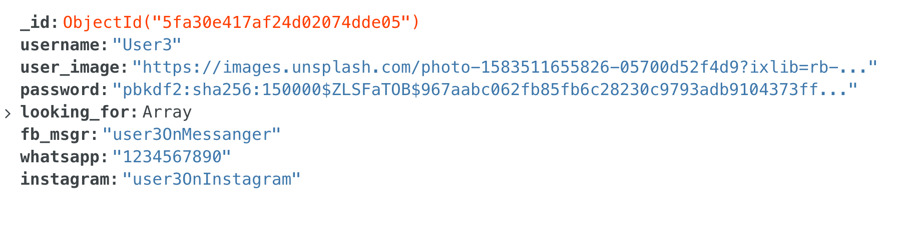

    - **Items** - The main function is to store data about each item which is visually then rendered in item cards. The secondary function is to be used in 'liking' and 'matching' functionality as well as searching and filtering. This data is inserted on the 'Add Item' page, which can be edited on the 'Edit Item' page, and displayed across the website in item cards. Used in back-end logic across all pages to display item footer icons depending if the user is logged in, creator of the account, or admin. 

    

    - **Matches** - Used mainly in matching logic to keep track of which users are the logged-in user liked by. This collection is mainly used alongside the 'items' collection to facilitate 'liking' and 'matching' functionality.

    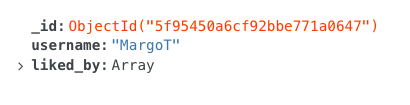

    -  **Categories** - Used to keep all types of categories (such as item fit, item categories, profile image link
    s, etc.) as arrays that are mainly used in dropdowns and to display item category filter.

    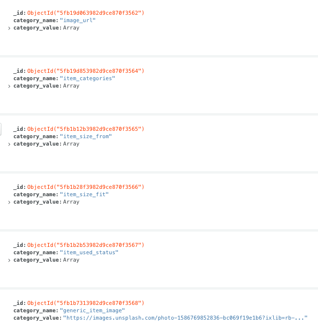


### Relationship
- The relationship between different fields is shown in the image below. Even though the database used in this project was non-relation, I believe in the future this project could benefit from a SQL based relation database

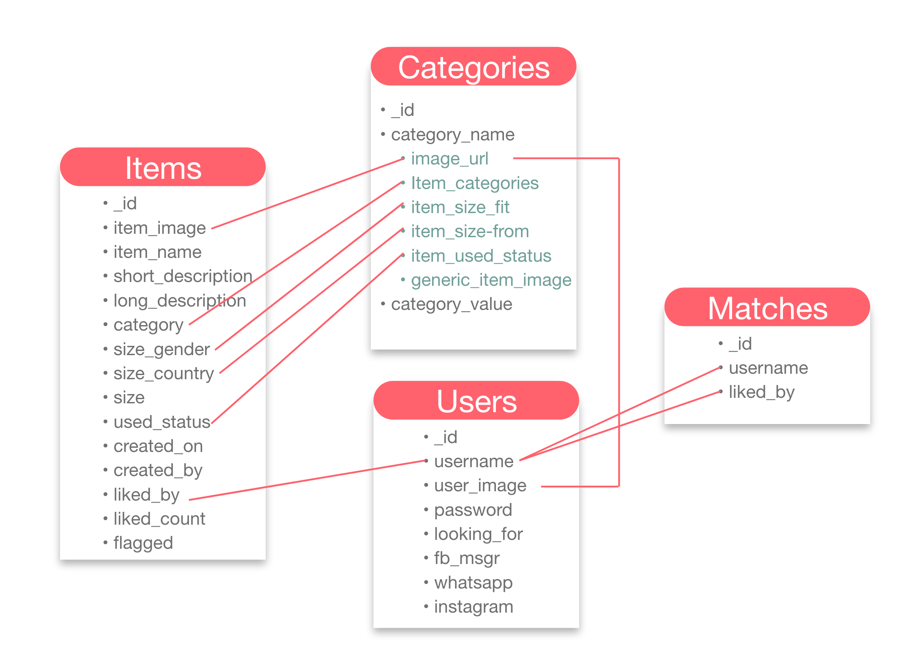

## Testing

All testing was documented in [testing.md](https://github.com/LigaMoon/swap-clothes-app/blob/main/testing.md) file

<a href="https://github.com/LigaMoon/swap-clothes-app/blob/main/testing.md">   
:bar_chart: </a>  :point_left: testing.md


## Deployment
### Local
Instructions to run the project on your local device using an IDE

#### Pre-requisites
- [Python 3](https://www.python.org/downloads/) - used to write the code and to run the project
- [PIP](https://pypi.org/project/pip/) - used to install packages
- [Git](https://git-scm.com/downloads) - used for version control
- [Visual Studio Code](https://code.visualstudio.com/) or any IDE of your choice - used to compile the code.
- [MongoDB Atlas](https://www.mongodb.com/cloud/atlas) account - used to facilitate databases and collections needed throughout the project. More detailed instructions on how to get started in [Mongo DB Atlas docs](https://docs.atlas.mongodb.com/)

#### Recommended
- A virtual environment of your choice - used to contain all installations and packages and prevents clashing projects that might use the same package but different versions.
    - Python 3 has a built-in virtual environment [venv](https://docs.python.org/3/tutorial/venv.html). To initialize:

            python3 -m venv .venv
        where `.venv` is the name/path you are giving to the virtual environment

### Steps
1. Go to the project repository https://github.com/LigaMoon/swap-clothes-app
1. Get the files used by using one of the methods below:
    1. Download the files used by clicking the 'Code' button located in the top section of the repository. Then select 'Download ZIP' and unzip the files in the directory of your choice.

    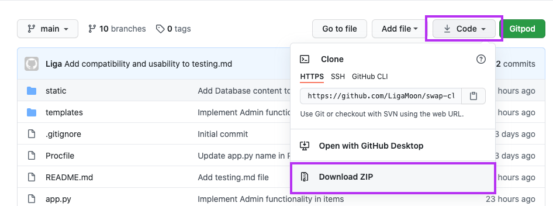 
    
    1. Clone the repository by running the following command from your IDE

            git repo clone LigaMoon/swap-clothes-app
    
1. In your IDE, navigate to the project directory where you located downloaded files/cloned the repo

        cd path/to/your/folder
1. Activate your virtual environment. If using Python's venv:

        source .venv/bin/activate
    on MacOS and Unix where .venv is the name you gave previously

        .venv\Scripts\activate.bat
    on Windows where .venv is the name you gave previously

1. Install all reqauirements from [requirements.txt](requrements.txt) file
    
        pip3 install -r requirements.txt

1. Create a file `env.py` to store environment variables
1. Add environment variable in the format as shown below

        os.environ.setdefault("SECRET_KEY", "")
        os.environ.setdefault("MONGO_URI", "")
    where `SECRET_KEY` value is a key of your choice and `MONGO_URI` is obained from your MongoDB account under Overview > Connect > Connect your application and select relevant version of Python.

1. Create the structure as outlined in the [Database](#database) section and below
    - Database name 'swap-clothes'
    - collection 'items'

            _id: <ObjectId>
            item_image: <String>
            item_name: <String>
            short_description: <String>
            long_description: <String>
            category: <String>
            size_gender: <String>
            size_country: <String>
            size: <String>
            used_status: <String>
            created_on: <Date>
            created_by: <String>
            liked_by: <Array>
            liked_count: <Int32>
            flagged: <String>

    - collection 'users'

            _id: <ObjectId>
            username: <String>
            user_image: <String>
            password: <String>
            looking_for: <Array>
            fb_msgr: <String>
            whatsapp: <String>
            instagram: <String>

    - collection 'matches'

            _id: <ObjectId>
            username: <String>
            liked_by: <Array>

    - collection 'categories'

            _id: <ObjectId>
            category_name: <String>
            category_value: <Array>

        - You will need 6 documents in the 'categories' collection with the following values

| _id | category_name | category_value |
 --- | --- | ---
generated_automatically | item_categories | Array 
generated_automatically | item_size_from | Array
generated_automatically | item_size_fit | Array
generated_automatically | item_used_status | Array
generated_automatically| "generic_item_image | Array
generated_automatically| "generic_item_image | Array with nested arrays (see below)

 

1. Run the application
```
python3 app.py
```

1. Website should be available on a link similar to `http://127.0.0.1:5000`. (check your IDE terminal)
1. Note: `python3` and `pip3` commands can vary depending on version/machine/IDE you're using. Always check docs if unsure.

## Remote
### Pre-requisites
- Create an account on [Heroku](https://dashboard.heroku.com/apps)
- Create a new app on the Heroku website
- Go to the app and select 'Deploy' tab

    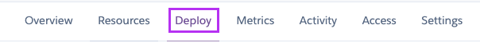

- Deploy your app using GitHub and enable Automatic Deploys

    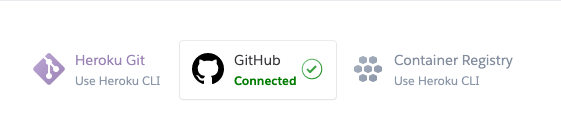


### Steps
1. Create the requirements.txt file to contain all dependencies

        pip3 freeze --local > requirements.txt

1. Create a Procfile

        echo web: python app.py > Procfile

1. Add environment variables
    - Go to the 'Settings' tab and click 'Reveal Config Vars' and add the following variables
        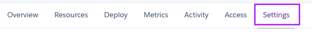


    | Key | Value |
 --- | ---
IP | 0.0.0.0
PORT | 5000
MONGO_DBNAME | swap_clothes
MONGO_URI | `mongodb+srv://<username>:<password>@<cluster_name>-qtxun.mongodb.net/<database_name>?retryWrites=true&w=majority`
SECRET_KEY | `<your_secret_key>`

1. Make sure all your files have been added, committed and pushed to your GitHub repository

1. Open your app

    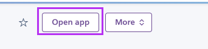


## Credits

### Code :floppy_disk:
- Most of the code was written  by author Liga Baikova
- Pop-ups were coded using [Sweetalert 2](https://sweetalert2.github.io/)
- Item carousels use [Slick](https://kenwheeler.github.io/slick/)
- Front end components were coded using [Materialize v1.0.0](https://materializecss.com/)
- Select validation used code provided in Code Institute DataBase Mini Project video
- Code to delay page from opening 
- Code 


### Media :clapper:
- All images used were taken from [Unsplash](https://unsplash.com/)
- All graphics used were taken from [Pablo Stanley from Hhmaaans](https://www.humaaans.com/) and [Katerina Limpitsouni from unDraw](https://undraw.co/)


### Acknowledgements
- Thank you to everyone who took their time to provide me constructive feedback on the Slack community page.
- Thanks to my friends and family for endless testing.
- Big thanks to my mentor for putting up with my questions and giving me great insights.
